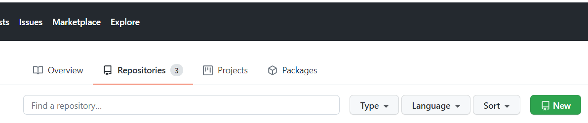
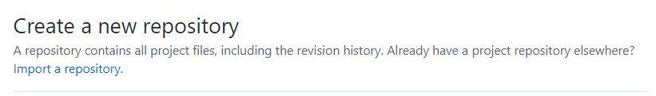
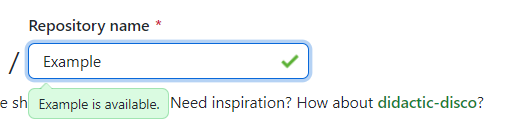
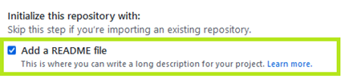
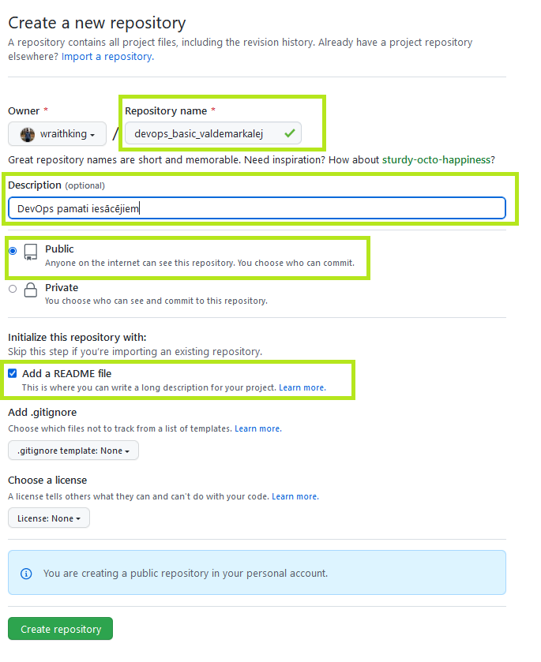
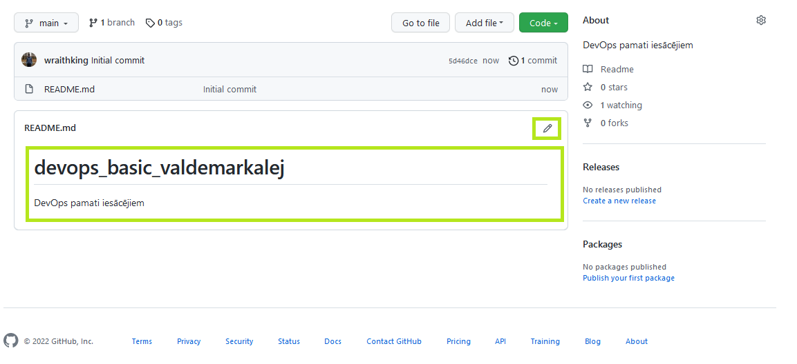
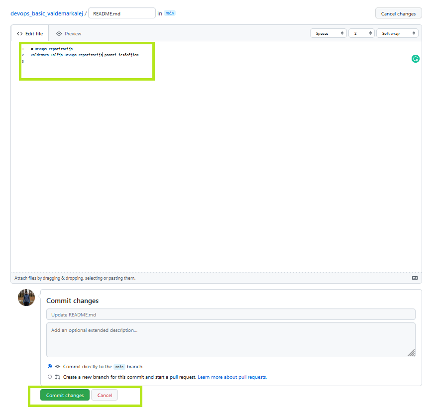
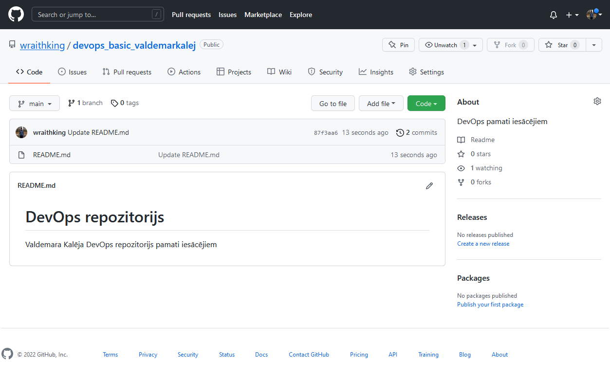

##### Latvijas Universitātes Vadības un uzņēmējdarbības mācību centrs
##### (LU VUMC)

# DEVOPS PAMATI IESĀCĒJIEM
# 2022

ESF projekts Nr. 8.4.1.0/16/l/001
‘’Nodarbināto personu profesionālās kompetences pilnveide”

## 1.Tēma
### Kopsavilkums
1. Jāizveido jauns repozitorijs GitHub - [https://github.com/](https://github.com/) , kurš satur README.md
failu
Jānodod: links uz repozitoriju
2. Jāuzstada programmu git no vietnes - [https://git-scm.com/](https://git-scm.com/) ievērojot jūsu operētājsistēmas prasības. 

Ja rodas jautājumi: noskatīties pamācību [https://www.youtube.com/watch?v=4xqVv2lTo40](https://www.youtube.com/watch?v=4xqVv2lTo40)
[https://www.youtube.com/watch?v=4xqVv2lTo40](https://www.youtube.com/watch?v=4xqVv2lTo40)

Jānodod: bilde no jūsu darba stacijas Windows (Linux vai Mac) ar to ka git ir uzstādīts.
Palaižot komandu git (Windows : cmd vai Windows PowerShell vai Windows Terminal;
Linux: bash vai zsh shell; Mac Os: Terminal app)
3. Jāuzstada vienu no koda rediģēšanas programmas no saraksta zemāk:
Visual studio code - [https://code.visualstudio.com/](https://code.visualstudio.com/)
Notepad++ - [https://notepad-plus-plus.org/downloads/](https://notepad-plus-plus.org/downloads/)
Sublime Text - [https://www.sublimetext.com/](https://www.sublimetext.com/)
Atom - [https://atom.io/](https://atom.io/)
Jānodod: bilde no jūsu redaktora ar Hello world programmu jebkura programmēšanas valoda, kuru pārvaldāt ar attiecīgo stilu.

Materiāli kurus būtu labi apskatīties:
DevOps tehnoloģiju un riku apkopojums - [https://roadmap.sh/devops](https://roadmap.sh/devops)
Terrafrom ieskats - [https://www.hashicorp.com/products/terraform](https://www.hashicorp.com/products/terraform)
Ansible ieskats - [https://www.redhat.com/en/technologies/management/ansible](https://www.redhat.com/en/technologies/management/ansible)
Jira par ITIL – [https://www.atlassian.com/blog/jira-service-desk/jira-service-desk-itil-
certified](https://www.atlassian.com/blog/jira-service-desk/jira-service-desk-itil-
certified)
Jira par ITSM – [https://www.atlassian.com/software/jira/service-management/itsm-
software](https://www.atlassian.com/software/jira/service-management/itsm-
software)
Jira Agile manisfesto - [https://www.atlassian.com/agile/manifesto](https://www.atlassian.com/agile/manifesto)
Jira par Scrum - [https://www.atlassian.com/agile/scrum](https://www.atlassian.com/agile/scrum)
Jira par Kanban - [https://www.atlassian.com/agile/kanban](https://www.atlassian.com/agile/kanban)
Jira par Agile un DevOps - [https://www.atlassian.com/agile/devops](https://www.atlassian.com/agile/devops)
! Tiem kuri nav pieraduši strādāt ar OS termināliem uzstādīt papildus:
GitHub Desktop - [https://desktop.github.com/](https://desktop.github.com/)

## Mājasdarba pamācība
Skatīties ja pēc vairākiem mēģinājumiem nesanāk.

Nospiest uz pogas New, lai izveidotu jaunu repozitoriju

Aizpildiet jaunā repozitorija nosaukumu ar nosaukumu – devops_basic_vardsuzv
Piem: devops_basic_valdemarkalej

Atzīmējiet, lai repozitorijs būtu publisks

Atzīmējiet, lai repozitoria būtu README fails
Rezultātā jābūt. Pārliecināmies un spiežam – create repository

Nospiest uz pogas ar zīmuļa zīmi, lai izveidotu veiktu izmaiņas faila

Uzraksiet tekstu:

\# DevOps repozitorijs
<Vārds Uzvārds> DevOps repozitorijs pamati iesācējiem

Rezultāts

